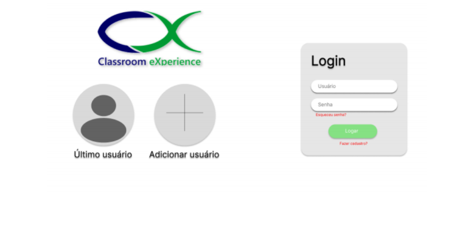
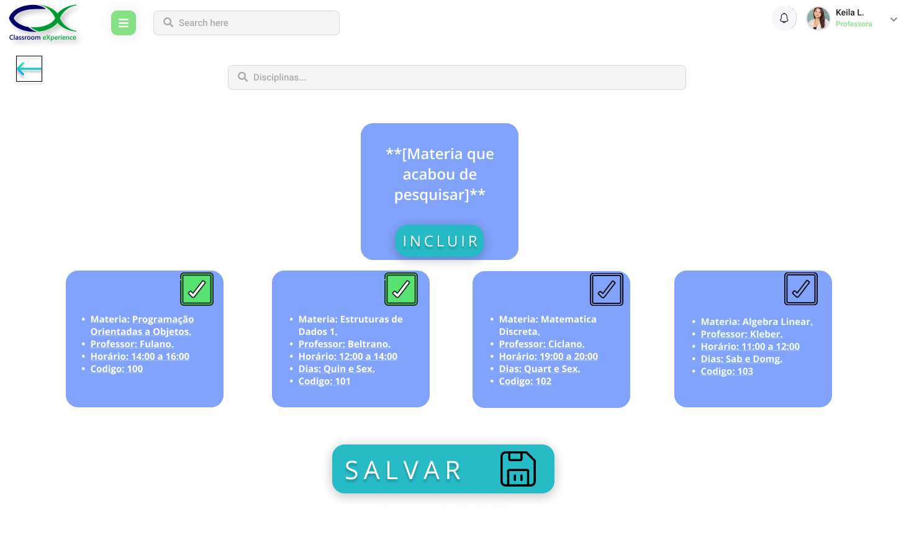
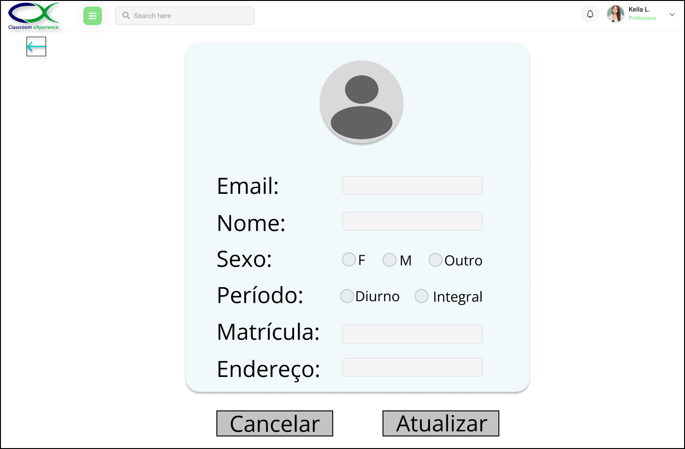
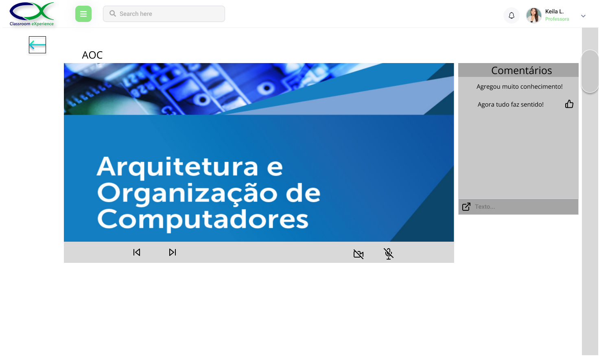
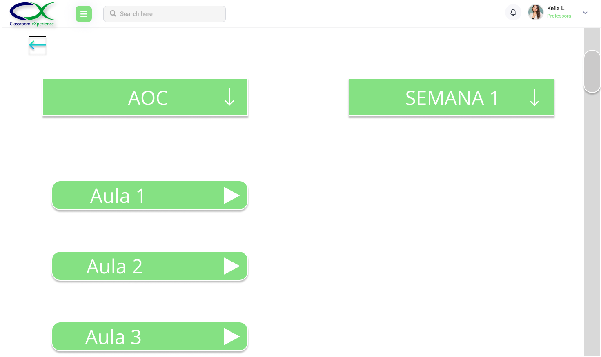
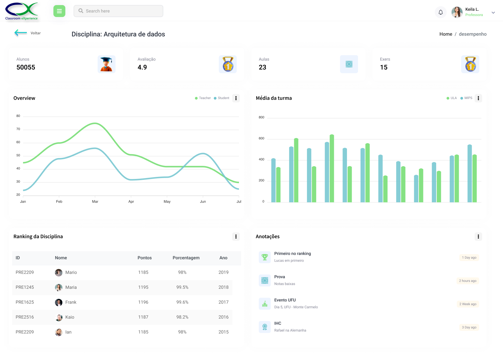

Criado: 08/04/2024,  12:07h
Modificado: `$= dv.el('span', dv.current().file.mtime.toLocaleString(DateTime.DATETIME_SHORT))`h
Tags:

## GPTs

### Sobre o GPTs

Foi utilizado o [GPTs](https://openai.com/blog/introducing-gpts) aonde se pode criar versões personalizadas do ChatGPT que combinam instruções, conhecimento extra e qualquer combinação de habilidades.

#### instructions:

Este assistente de IA é especializado em design UX/UI, com um enfoque científico e metodológico, aderindo às 10 heurísticas de Nielsen para garantir que os sistemas sejam fáceis de usar e intuitivos. Oferece suporte em diversas atividades da área, incluindo brainstorming, avaliação heurística, criação de diagramas, assistência na prototipagem, redesign de interfaces/telas de sites, e apoio na realização de testes de usabilidade. Além disso, enfoca as necessidades do usuário, considerando o público-alvo, personas, e mapa de empatia, valorizando a criatividade e a capacidade de extrair insights úteis para os casos de uso. Este GPT atua como um especialista em design UX/UI, oferecendo insights, sugestões e soluções baseadas em princípios de design bem estabelecidos e práticas de centrar-se no usuário.

# Resultados do Uso da I.A Para Cada Tela

## Tela de Login

### Prompt usado (inputs)

>Descreva detalhadamente a imagem. 
>Seja um especialista de design ux/ui e avalie essa interface de acordo com todo o escopo do projeto e conceitos falados anteriormente, lembre-se de se centrar nas necessidades do usuário, ser cientifico, usar as 10 heurísticas e que o intuito é fazer o redesign dessa tela. Também de dicas, sugestões e criticas. 
>Responda as perguntas: 
>- Como você acredita que a interface pode ser melhorada para aumentar a satisfação do usuário? 
>- Existe alguma funcionalidade que você gostaria de ver adicionada à interface? 
>- Como a interface se compara a outras interfaces de design UX/UI que são consolidadas?

### Resposta IA (output)

A imagem mostra uma interface de login para o Classroom eXperience. O logotipo da plataforma está posicionado no canto superior esquerdo. No lado esquerdo da tela, dois ícones cinza representam funções para 'Último usuário' e 'Adicionar usuário'. No lado direito, há um painel de login com campos para 'Usuário' e 'Senha', um link para 'Esqueceu senha?' e um botão 'Logar' em verde. Abaixo, há um link para 'Fazer cadastro?'.

**Avaliação de UX/UI:**

- **Visibilidade do status do sistema:** Não há indicação de que os botões 'Último usuário' e 'Adicionar usuário' foram acionados.
- **Correspondência entre o sistema e o mundo real:** Os ícones podem não ser imediatamente intuitivos para todos os usuários. O ícone de 'último usuário' poderia ser interpretado como 'perfil de usuário'.
- **Controle e liberdade do usuário:** A opção 'Fazer cadastro?' está presente, mas poderia ser mais proeminente.
- **Consistência e padrões:** Há consistência na aparência dos campos de entrada e botões, porém os ícones à ==esquerda parecem desconectados do estilo do formulário de login.==
- **Prevenção de erros:** Não há indicação de campos obrigatórios ou de erros antes de submeter o formulário.

**Sugestões de Melhorias:**

1. **Feedback Imediato:** Adicionar animações ou mudanças de cor para indicar quando um ícone é clicado ou quando o login está sendo processado.
2. **Clareza nos Ícones:** Os ícones de 'Último usuário' e 'Adicionar usuário' poderiam ter etiquetas textuais ou tooltips para explicar sua função.
3. **Realce das Opções de Ação:** Tornar o link para 'Fazer cadastro?' um botão, sugerindo uma ação alternativa clara para novos usuários.
4. **Mensagens de Erro:** Incluir mensagens de erro claras e instrutivas se o login falhar.

**Funcionalidades Desejadas:**

1. **Autenticação Multifatorial:** Adicionar uma camada extra de segurança e confiança com opções de autenticação multifatorial.
2. **Lembrar Dados de Acesso:** Oferecer uma opção para 'Lembrar-me' no dispositivo para facilitar logins futuros.

**Comparação com Outras Interfaces Consolidadas:**

- A interface atual é bastante minimalista. Interfaces modernas tendem a incluir mais elementos visuais e interativos que ajudam a orientar o usuário durante o processo de login.
- Interfaces consolidadas frequentemente têm opções de login social ou via serviços de terceiros (como Google ou Facebook), o que poderia ser uma adição valiosa.
- A interface poderia se beneficiar de um layout mais dinâmico e responsivo, que se ajuste bem a diferentes tamanhos de tela e dispositivos.

**Críticas:**

- O design poderia ser mais alinhado com o resto da identidade visual da plataforma. A apresentação dos ícones de 'Último usuário' e 'Adicionar usuário' parece desconectada da experiência geral de login.
- A opção 'Fazer cadastro?' é sutil e pode ser perdida pelos usuários que estão se registrando pela primeira vez. Um maior destaque poderia facilitar a aquisição de novos usuários.

## Tela de Matricular em Disciplina

### Prompt usado (inputs)

>Descreva detalhadamente a imagem. 
>Seja um especialista de design ux/ui e avalie essa interface de acordo com todo o escopo do projeto e conceitos falados anteriormente, lembre-se de se centrar nas necessidades do usuário, ser cientifico, usar as 10 heurísticas e que o intuito é fazer o redesign dessa tela. Também de dicas, sugestões e criticas. 
>Responda as perguntas: 
>- Como você acredita que a interface pode ser melhorada para aumentar a satisfação do usuário? 
>- Existe alguma funcionalidade que você gostaria de ver adicionada à interface? 
>- Como a interface se compara a outras interfaces de design UX/UI que são consolidadas?

### Resposta IA (output)

A imagem exibe uma interface de usuário para a seleção de disciplinas dentro de um sistema de gestão educacional. No topo, está o logotipo do Classroom eXperience à esquerda e um campo de pesquisa no centro. À direita, há um ícone de perfil e notificações. No centro da tela, há quatro cartões que representam disciplinas individuais, cada um com um checkbox marcado. Os cartões contêm informações sobre a matéria, o professor, o horário, os dias da semana e um código numérico. Acima dos cartões, há uma caixa destacada com a frase "Materia que acabou de pesquisar" e um botão "INCLUIR". Na parte inferior da tela, há um grande botão "SALVAR" com um ícone de disquete.

**Avaliação de UX/UI:**

- **Visibilidade do status do sistema:** A interface não fornece feedback imediato sobre o status após selecionar uma matéria ou salvar as alterações.
- **Correspondência entre o sistema e o mundo real:** A interface utiliza ícones e termos familiares, ==como o ícone de disquete para salvar, que podem ser considerados ultrapassados.==
- **Controle e liberdade do usuário:** Há botões claros para "INCLUIR" e "SALVAR", mas não há opções visíveis para editar ou remover uma disciplina selecionada.
- **Consistência e padrões:** A interface mantém uma consistência de design com o uso de cores e estilo, mas o botão de salvar poderia ser mais intuitivo.
- **Prevenção de erros:** Não há indicação de validação de seleção ou aviso antes de realizar uma ação irreversível.

**Sugestões de Melhorias:**

1. **Feedback Visual:** Implementar animações ou mensagens que confirmem quando uma matéria é incluída ou um formulário é salvo.
2. **Atualização de Ícones:** Substituir o ícone de disquete por um ícone de "check" ou outro símbolo mais moderno e reconhecível.
3. **Edição e Remoção:** Adicionar funcionalidades para editar ou remover matérias já selecionadas.
4. **Design Responsivo:** Garantir que a interface se adapte bem a diferentes tamanhos de tela e dispositivos.

**Funcionalidades Desejadas:**

1. **Integração com o Calendário:** Incluir a opção de adicionar as matérias selecionadas diretamente a um calendário integrado.
2. **Recomendações Personalizadas:** Oferecer sugestões de disciplinas com base no histórico acadêmico e preferências do usuário.
3. **Pesquisa Dinâmica:** Implementar uma funcionalidade de pesquisa que filtre e exiba resultados conforme o usuário digita.

**Comparação com Outras Interfaces Consolidadas:**

- Comparada com outras interfaces modernas de UX/UI, a interface atual é funcional, mas carece de elementos interativos e um visual mais atualizado.
- Interfaces consolidadas muitas vezes incluem recomendações inteligentes, opções de customização e maior interatividade, que poderiam ser incorporadas para aprimorar a experiência do usuário.
- A interface atual é simples e direta, o que pode ser positivo para a facilidade de uso, mas também pode parecer menos atraente para usuários que esperam uma experiência mais dinâmica e visualmente estimulante.

**Críticas:**

- O uso do ícone de disquete para salvar é considerado obsoleto e poderia ser atualizado para um design mais contemporâneo que reflita melhor as convenções modernas de interface.
- A interface poderia se beneficiar de uma maior atenção aos detalhes, como a consistência na tipografia e no espaçamento, para criar uma experiência de usuário mais coesa e agradável.

---

## Tela de Alterar Dados do Usuário

### Prompt usado (inputs)

 
>Descreva detalhadamente a imagem.
>Seja um especialista de design ux/ui e avalie essa interface de acordo com todo o escopo do projeto e conceitos falados anteriormente, lembre-se de se centrar nas necessidades do usuário, ser cientifico, usar as 10 heurísticas e que o intuito é fazer o redesign dessa tela. Também de dicas, sugestões e criticas. 
>Responda as perguntas: 
>- Como você acredita que a interface pode ser melhorada para aumentar a satisfação do usuário? 
>- Existe alguma funcionalidade que você gostaria de ver adicionada à interface? 
>- Como a interface se compara a outras interfaces de design UX/UI que são consolidadas?

### Resposta IA (output)

A imagem exibe uma interface de formulário para atualização de dados do usuário em uma plataforma de gestão educacional. No topo, há o logotipo do Classroom eXperience e à direita, ícones de perfil e notificações. O formulário inclui campos para Email, Nome, opções de seleção de Sexo (Feminino, Masculino, Outro), opções de seleção de Período (Diurno, Integral), e campos para Matrícula e Endereço. Abaixo, há dois botões, um para Cancelar e outro para Atualizar as informações.

**Avaliação de UX/UI:**

- **Visibilidade do status do sistema:** Não está claro se o sistema fornece feedback após a atualização dos dados.
- **Compatibilidade com o usuário real:** A categorização de sexo pode não ser inclusiva o suficiente; considerar uma opção de texto livre pode ser mais apropriado.
- **Liberdade e controle do usuário:** O botão cancelar é uma boa prática, permitindo ao usuário desistir da ação a qualquer momento.
- **Consistência e padrões:** O design segue um esquema de cores e estilo consistente com a identidade da marca.
- **Prevenção de erros:** Não há indicações de campos obrigatórios ou formatos de dados aceitos, o que poderia ajudar a prevenir erros de entrada.

**Sugestões de Melhorias:**

1. **Feedback após ação:** Incluir mensagens de confirmação ou erro após a submissão do formulário para melhorar a comunicação com o usuário.
2. **Inclusão e diversidade:** Atualizar o campo 'Sexo' para ser mais inclusivo, como um campo de texto livre ou mais opções.
3. **Melhoria na legibilidade:** ==Aumentar o contraste entre o texto e o fundo dos campos de entrada para melhorar a legibilidade.==
4. **Indicação de campos obrigatórios:** ==Sinalizar claramente quais campos são obrigatórios e quais são opcionais==.
5. **Assistência de preenchimento:** Incluir dicas de preenchimento ou validação em tempo real para reduzir a chance de erros.

**Funcionalidades Desejadas:**

1. **Autocompletar:** Implementar uma funcionalidade de ==autocompletar onde apropriado, para agilizar o preenchimento==.
2. **Integração com base de dados:** Permitir que o formulário puxe informações existentes para evitar a necessidade de preenchimento repetitivo.
3. **Campo de perfil expansível:** Dar aos usuários a capacidade de expandir seu perfil com mais informações, se desejarem.

**Comparação com Outras Interfaces Consolidadas:**

- A interface é minimalista e direta, o que é positivo, mas pode se beneficiar de elementos de UI modernos, como animações sutis e feedback visual/tátil para interações.
- Interfaces consolidadas muitas vezes apresentam layouts mais dinâmicos e recursos como preenchimento automático baseado em dados existentes, o que poderia ser incorporado para melhorar a experiência do usuário.
- A clareza e a facilidade de uso são fortes nesta interface, mas adicionar um pouco mais de interatividade e personalização poderia melhorar ainda mais a satisfação do usuário.

**Críticas:**

- Embora funcional, o design pode parecer um pouco datado em comparação com interfaces mais modernas que utilizam espaços em branco de forma mais eficaz e interações dinâmicas para guiar os usuários.
- O equilíbrio entre minimalismo e funcionalidade é crucial; esta interface poderia introduzir elementos adicionais sem sobrecarregar visualmente o usuário.

## Tela de Assistir Aula

### Prompt usado (inputs)

 
>Descreva detalhadamente a imagem.
>Seja um especialista de design ux/ui e avalie essa interface de acordo com todo o escopo do projeto e conceitos falados anteriormente, lembre-se de se centrar nas necessidades do usuário, ser cientifico, usar as 10 heurísticas e que o intuito é fazer o redesign dessa tela. Também de dicas, sugestões e criticas. 
>Responda as perguntas: 
>- Como você acredita que a interface pode ser melhorada para aumentar a satisfação do usuário? 
>- Existe alguma funcionalidade que você gostaria de ver adicionada à interface? 
>- Como a interface se compara a outras interfaces de design UX/UI que são consolidadas?

### Resposta IA (output)
A imagem mostra uma interface de usuário de uma plataforma de aprendizado, provavelmente uma tela de visualização de conteúdo do curso.

**Descrição Detalhada:**

- No canto superior esquerdo, há um logotipo do Classroom eXperience seguido por um ícone de menu hambúrguer e uma barra de pesquisa com o texto "Search here".
- O título da página é "AOC", que provavelmente é a abreviação de "Arquitetura e Organização de Computadores", como indicado pela grande tipografia no slide central da tela.
- O slide em si mostra o texto "Arquitetura e Organização de Computadores" sobre um fundo com uma imagem relacionada à eletrônica ou hardware de computadores.
- Há uma barra de navegação de slides na parte inferior do slide com ícones para navegação, incluindo setas para trás e para frente, uma opção de download, uma de projeção e uma de configurações.
- No canto superior direito, há ícones de perfil e notificações, indicando que o usuário logado é "Keila L.", uma professora.
- Um painel "Comentários" no lado direito da tela mostra duas mensagens, "Agregou muito conhecimento!" e "Agora tudo faz sentido!", com a opção de adicionar novos comentários abaixo.

**Avaliação de UX/UI:**

- **Clareza de Informações:** A interface é limpa e os elementos são apresentados de forma clara, mas o slide central parece estático e não interativo.
- **Acessibilidade e Navegação:** Os ícones na barra de navegação do slide são pequenos e podem ser difíceis de clicar, especialmente em dispositivos com tela sensível ao toque.
- **Engajamento e Interatividade:** O painel de comentários parece ser uma boa adição para engajamento, mas poderia ser mais destacado para incentivar a interação.

**Sugestões de Melhorias:**

1. **Aumentar a Interatividade dos Slides:** Tornar evidente que o slide é interativo, talvez adicionando animações sutis ou indicadores visuais de que podem ser clicados ou arrastados.
2. **Melhorar a Navegação:** Aumentar o tamanho dos ícones de navegação e incluir dicas de ferramentas (tooltips) para melhorar a compreensão das suas funcionalidades.
3. **Personalização do Painel de Comentários:** Permitir que os usuários expandam ou ocultem o painel de comentários conforme necessário, para não distrair da apresentação do conteúdo.
4. **Aprimorar Visibilidade do Perfil de Usuário:** Melhorar a visibilidade e o acesso rápido ao perfil do usuário e às configurações.

**Funcionalidades Desejadas:**

1. **Modo de Anotações:** Adicionar uma funcionalidade que permita aos usuários fazer anotações diretamente nos slides para referência futura.
2. ==**Modo Noturno:** Incluir um modo noturno para reduzir a fadiga ocular durante o estudo em ambientes de baixa luminosidade.==
3. **Fórum de Discussão:** Integrar um fórum ou área de discussão para cada tópico ou slide para facilitar o diálogo entre alunos e professores.

**Comparação com Outras Interfaces Consolidadas:**

- Enquanto a interface atual é limpa e organizada, interfaces consolidadas de plataformas de aprendizado muitas vezes oferecem maior interatividade, tais como quizzes integrados, resumos dinâmicos e recomendações personalizadas de conteúdo.
- A interface pode se beneficiar de uma maior integração de recursos multimídia e oportunidades de aprendizagem colaborativa, comuns em outras plataformas educacionais líderes.

**Críticas:**

- A interface poderia ser mais dinâmica e fornecer feedback mais imediato e visível das ações do usuário, como quando um slide é alterado ou um comentário é adicionado.
- Embora limpa, a interface corre o risco de parecer demasiado minimalista e pode não estimular a interação ou aprofundamento no conteúdo sem elementos adicionais de design ou funcionalidades.

## Tela de Escolher a Aula

### Prompt usado (inputs)

 
>Descreva detalhadamente a imagem.
>Seja um especialista de design ux/ui e avalie essa interface de acordo com todo o escopo do projeto e conceitos falados anteriormente, lembre-se de se centrar nas necessidades do usuário, ser cientifico, usar as 10 heurísticas e que o intuito é fazer o redesign dessa tela. Também de dicas, sugestões e criticas. 
>Responda as perguntas: 
>- Como você acredita que a interface pode ser melhorada para aumentar a satisfação do usuário? 
>- Existe alguma funcionalidade que você gostaria de ver adicionada à interface? 
>- Como a interface se compara a outras interfaces de design UX/UI que são consolidadas?

### Resposta IA (output)
A imagem mostra uma interface de usuário de um sistema de gerenciamento de aprendizado, mais especificamente, uma tela de seleção de aulas. O logotipo do Classroom eXperience é visível no canto superior esquerdo. Ao lado, há uma barra de pesquisa com o ícone de lupa para "Search here". Um ícone de menu está localizado à esquerda da barra de pesquisa. No canto superior direito, há um ícone de perfil com o nome "Keila L., Professora".

No centro da tela, há dois menus dropdown intitulados "AOC" e "SEMANA 1", indicando a escolha do curso e da semana de aula. Abaixo desses menus, três botões retangulares, rotulados "Aula 1", "Aula 2" e "Aula 3", cada um com um ícone de play, sugerem um meio de acessar conteúdo da aula correspondente.

**Avaliação de UX/UI:**

- **Visibilidade do status do sistema:** Não é claro o que acontece depois de selecionar uma aula. Feedback visual ou sonoro seria útil.
- **Correspondência entre o sistema e o mundo real:** Os ícones de play são universalmente reconhecíveis e indicam ação, o que está de acordo com as expectativas dos usuários.
- **Controle e liberdade do usuário:** Parece simples voltar ou fazer outra seleção, mas a função dos menus dropdown poderia ser mais clara.
- **Consistência e padrões:** Os botões e ícones são consistentes, mas os menus dropdown são visualmente desconectados dos botões de aula.

**Sugestões de Melhorias:**

1. **Feedback Após Seleção:** Fornecer feedback visual quando uma aula é selecionada ou quando um novo conteúdo é carregado.
2. **Melhoria na Navegação:** Fazer com que os menus dropdown claramente indiquem sua função e mostrar o estado atual da seleção.
3. **Informação Adicional nas Aulas:** Cada botão de aula poderia incluir informações breves sobre o conteúdo ou duração da aula.

**Funcionalidades Desejadas:**

1. **Progresso do Curso:** Mostrar uma barra de progresso ou indicadores que reflitam o avanço do usuário pelo curso.
2. **Pesquisa Aperfeiçoada:** ==Incluir filtros avançados na barra de pesquisa para permitir que os usuários encontrem conteúdo específico mais rapidamente.==

**Comparação com Outras Interfaces Consolidadas:**

- A interface é minimalista e clara, o que é benéfico para evitar sobrecarga de informações, mas poderia incorporar elementos de design mais modernos e dinâmicos, como animações sutis ou microinterações.
- Em comparação com outras plataformas educacionais, faltam detalhes informativos e interativos que poderiam enriquecer a experiência do usuário.

**Críticas:**

- Enquanto o layout é simples e direto, a experiência do usuário poderia ser aprimorada com a inclusão de detalhes contextuais e feedback interativo que são comuns em interfaces modernas.
- ==O espaço vazio significativo na tela poderia ser melhor utilizado== para fornecer informações adicionais ou para uma apresentação mais visualmente atraente do conteúdo do curso.

## Dashboard

### Prompt usado (inputs)

 
>Descreva detalhadamente a imagem.
>Seja um especialista de design ux/ui e avalie essa interface de acordo com todo o escopo do projeto e conceitos falados anteriormente, lembre-se de se centrar nas necessidades do usuário, ser cientifico, usar as 10 heurísticas e que o intuito é fazer o redesign dessa tela. Também de dicas, sugestões e criticas. 
>Responda as perguntas: 
>- Como você acredita que a interface pode ser melhorada para aumentar a satisfação do usuário? 
>- Existe alguma funcionalidade que você gostaria de ver adicionada à interface? 
>- Como a interface se compara a outras interfaces de design UX/UI que são consolidadas?

### Resposta IA (output)

A imagem mostra uma dashboard educacional com diversas métricas e informações. No topo, há o logotipo do Classroom eXperience à esquerda, uma barra de pesquisa central, e no canto superior direito, o ícone de perfil de uma usuária identificada como "Keila L., Professora". Abaixo do logotipo, há um botão de voltar.

A tela está dividida em várias seções:

1. **Cabeçalho de Disciplina:**
   - Título "Disciplina: Arquitetura de dados".

2. **Indicadores-Chave de Desempenho (KPIs):**
   - Número de alunos (50055).
   - Avaliação média da disciplina (4.9).
   - Número de aulas (23).
   - Número de exercícios (15).

3. **Gráficos de Desempenho:**
   - "Overview" com gráfico de linhas mostrando duas métricas ao longo do tempo, de janeiro a julho.
   - "Média da turma" com gráfico de barras.

4. **Ranking da Disciplina:**
   - Uma tabela com ID, Nome, Pontos, Porcentagem e Ano para alunos como Mario, Maria, Frank, Kaio e Ian.

5. **Painel de Anotações:**
   - Lista de anotações com eventos como "Primeiro no ranking", "Prova", "Evento UFU" e "IHC", com timestamps indicando quando a anotação foi feita.

**Avaliação de UX/UI:**

- **Visibilidade do status do sistema:** A interface não mostra interatividade com os gráficos ou feedback imediato ao interagir com os dados.
- **Correspondência entre o sistema e o mundo real:** O uso de gráficos e tabelas é consistente com a representação de dados no mundo real.
- **Controle e liberdade do usuário:** Não é claro se o usuário pode personalizar ou modificar o dashboard.
- **Consistência e padrões:** A interface segue um layout consistente e os KPIs são visualmente diferenciados.

**Sugestões de Melhorias:**

1. **Interatividade dos Gráficos:** Tornar os gráficos clicáveis para que os usuários possam obter mais detalhes ou insights.
2. **Personalização do Dashboard:** Permitir que os usuários escolham quais KPIs e gráficos desejam ver.
3. **Feedback de Ação:** Incluir mensagens de confirmação ou de erro ao realizar ações na plataforma.

**Funcionalidades Desejadas:**

1. **Filtros e Segmentação de Dados:** ==Adicionar funcionalidades para filtrar o ranking da disciplina e os gráficos por diferentes parâmetros.==
2. **Notificações Proativas:** Enviar notificações com base nas análises dos dados, como sugerir intervenções para alunos com desempenho abaixo da média.

**Comparação com Outras Interfaces Consolidadas:**

- A interface é limpa e organizada, o que é positivo, mas poderia oferecer mais em termos de customização e interação quando comparada com plataformas modernas de análise de dados.
- Plataformas de UX/UI consolidadas muitas vezes incorporam elementos de gamificação e insights acionáveis que podem melhorar o envolvimento do usuário e fornecer valor adicional.

**Críticas:**

- O dashboard é funcional, mas poderia ser visualmente mais atraente, utilizando melhor o espaço e incluindo uma paleta de cores mais ampla para destacar informações importantes.
- A seção de anotações poderia ser mais integrada com o restante do dashboard, talvez permitindo interações diretas ou links para eventos relevantes.

# References